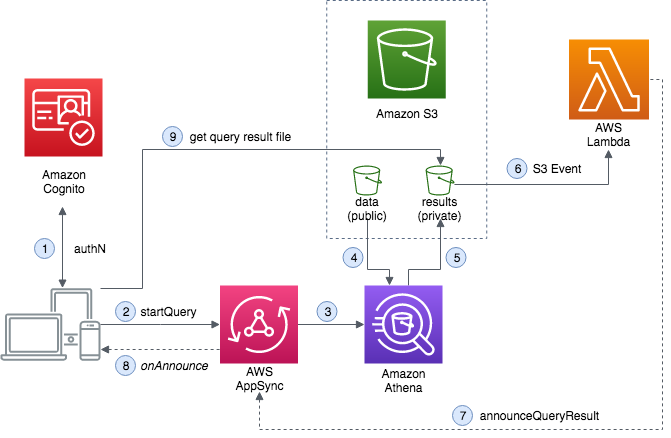
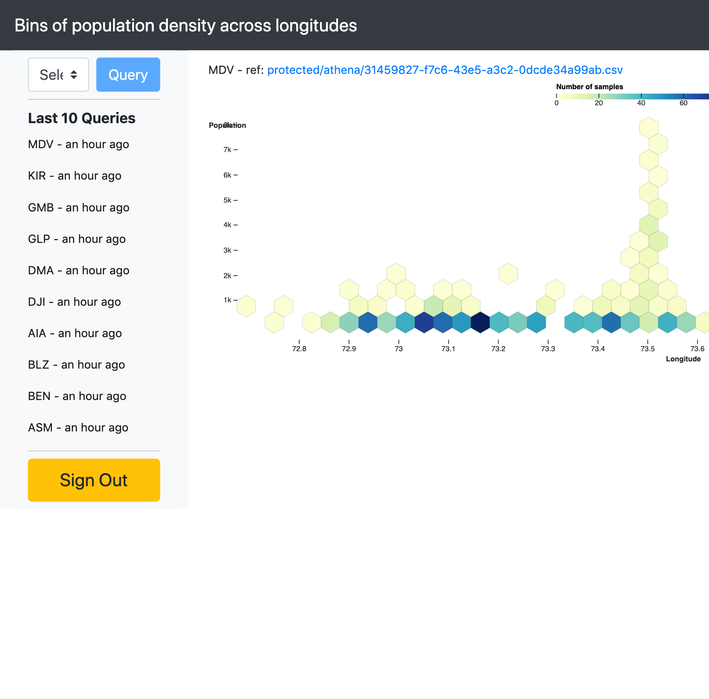

# Visualizing big data with AWS AppSync, Amazon Athena, and AWS Amplify

[](https://console.aws.amazon.com/amplify/home#/deploy?repo=https://github.com/aws-samples/aws-appsync-visualization-with-athena-app)

This project shows how to use [Amazon Athena](https://aws.amazon.com/athena/), [AWS AppSync](https://aws.amazon.com/appsync/), and [AWS Amplify](https://aws.amazon.com/amplify/) to build an application that interacts with big data. The application is built using React, the [AWS Amplify Javascript library](https://github.com/aws-amplify/amplify-js), and the [D3.js](https://d3js.org/) Javascript library to render custom visualizations.

The application code can be found in this [GitHub repository](https://github.com/aws-samples/aws-appsync-visualization-with-athena-app). It uses Athena to query data hosted in a public Amazon S3 bucket by the [Registry of Open Data on AWS](https://registry.opendata.aws/). Specifically, it uses the [High Resolution Population Density Maps + Demographic Estimates by CIESIN and Facebook](https://registry.opendata.aws/dataforgood-fb-hrsl/). 

This public dataset provides "population data for a selection of countries, allocated to 1 arcsecond blocks and provided in a combination of CSV and Cloud-optimized GeoTIFF files," and is hosted in the S3 bucket `s3://dataforgood-fb-data.`



## Updates

* 03/30/2020: Use envCache to define unique bucket per build environment
* 03/21/2020: Update layout with tailwindcss.
* 12/19/2019: New branch `with-auth` provides an implementation that tracks request per owner in a DynamoDB table. In introduces a pipeline resolver with 2 functions to interact with Amazon Athena and AWS Lambda in a single query. Using a `@dynamodb` and `@auth` transformer, access to past queries is limited to the query owners and the Lambda functions that create and update the table entries. To view the intial release (minus the auth), go to the [initial-release](https://github.com/aws-samples/aws-appsync-visualization-with-athena-app/tree/initial-release) branch.
  ```graphql
  type AthenaOperation
  @model
  @key(
    name: "ByOwner"
    fields: ["owner", "createdAt"]
    queryField: "queryByOwner"
  )
  @auth(
    rules: [
      { allow: owner, identityClaim: "sub" }
      { allow: private, provider: iam, operations: [create, update] }
    ]
  ) {
    id: ID!
    queryString: String!
    countryCode: String!
    status: STATUS!
    owner: String
    file: S3Object
    createdAt: String
  }
  ```
* 11/11/19: Updated to support multi auth with Amplify CLI. Requires Amplify CLI version 3.17 and above.

## Getting started

For more information about this app and how to get started, please see the [blog post](https://aws.amazon.com/blogs/mobile/visualizing-big-data-with-aws-appsync-amazon-athena-and-aws-amplify/).

### One-click launch

Deploy the application in a single step to the Amplify Console by clicking the button above.

### Clone and launch

Alternatively, you can clone the repository, deploy the backend with Amplify CLI, and build and serve the frontend locally.

First, install the Amplify CLI and step through the configuration.

```bash
npm install -g @aws-amplify/cli
amplify configure
```

Next, clone the repository and install the dependencies.

```bash
git clone https://github.com/aws-samples/aws-appsync-visualization-with-athena-app
cd aws-appsync-visualization-with-athena-app
yarn
```

Update the name of the storage bucket (`bucketName`) in the file `./amplify/backend/storage/sQueryResults/parameters.json` then initialize a new Amplify project and push the changes.

```bash
amplify init
amplify push
```

Finally, launch the application.

```bash
yarn start
```

## Application Overview

Here is how the application works:

1. Users sign in to the app using Amazon Cognito User Pools. The JWT access token returned at sign-in is sent in an authorization header to AWS AppSync with every GraphQL operation.
2. A user selects a country from the drop-down list and chooses Query. This triggers a GraphQL query. When the app receives the `QueryExecutionId` in the response, it subscribes to mutations on that ID.
3. Pipeline resolver:
   1. AWS AppSync makes a SigV4-signed request to the Athena API with the specified query.
   2. The results of the query request are sent to a Lambda function.
4. Lambda function stores the operation details for the owner in a DynamoDB table using AWS AppSync.
5. Athena runs the query against the specified table. The query returns the sum of the population at recorded longitudes for the selected country along with a count of latitudes at each longitude.
    ```sql
    SELECT longitude, count(latitude) as count, sum(population) as tot_pop
      FROM "default"."hrsl"
      WHERE country='${countryCode.trim()}'
      group by longitude
      order by longitude
    ```
6. The results of the query are stored in the result S3 bucket, under the `/protected/athena/` prefix. Signed-in app users can access these results using their IAM credentials.
7. Putting the query result file in the bucket generates an S3 event and triggers the announcer Lambda function.
8. The announcer Lambda function sends an `announceQueryResult` mutation with the S3 bucket and object information.
9.  The mutation triggers a subscription with the mutation's selection set.
10. The client retrieves the result file from the S3 bucket and displays the custom visualization.


